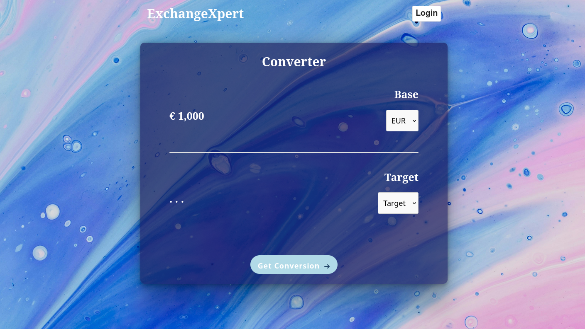

# ExchangeXpert

Esse serviço foi desenvolvido para fins de estudo. Nele o usuário pode fazer consultas para descobrir o valor de 1 Euro em outras moedas, a limitação da moeda de base vem devido a consumação de uma API gratuita.

## Screenshots



- Tela principal de consulta de taxas de câmbio.

## Tech Stack

**Client:** React, Vite

**Server:** Node.js, Express, PostgreSQL

## Competências

Durante o desenvolvimento deste projeto, apliquei algumas competências importantes. Abaixo estão os principais tópicos abordados:

- **Integração com APIs Externas**: Consumo da API Exchange Rates API para obter dados de taxas de câmbio em tempo real, utilizando requisições HTTP e tratamento de respostas assíncronas.
- **CRUD com Banco de Dados PostgreSQL**.
- **Rotas Cliente-Servidor**: Uso de rotas RESTful para comunicação entre o frontend e backend, garantindo que as requisições e respostas sejam tratadas corretamente.
- **Deploy com Heroku**.
- **Docker**: Dockerização da aplicação utilizando arquivos Dockerfile e docker-compose.
- **Autenticação e Autorização com JSON Web Tokens (JWT)**: Implementação de mecanismos de autenticação e autorização segura, gerando e validando JWT para controle de acesso do usuário.

Ferramentas de Desenvolvimento:

- **Eslint**: Para organização do código.
- **Winston (Logger)**: Captura de informações importantes do serviço.
- **Prettier**: Para formatação do código.

## Funcionalidades

- Consultar o valor de 1 Euro em diversas moedas em tempo real.
- Autenticação de usuários com JWT.
- Histórico de consultas de taxas de câmbio.
- Interface intuitiva e responsiva desenvolvida em React.

## Instalação

O serviço está disponível via Heroku para fácil acesso. Você pode visitar a aplicação aqui: https://exchange-xpert-cd459c52b763.herokuapp.com/

Nota: A versão atual desta aplicação não é totalmente segura para uso. Embora a criptografia de senhas esteja implementada usando bcrypt, recursos de segurança adicionais, como OAuth e criptografia avançada, não estão configurados. Use este serviço com cautela se estiver lidando com dados sensíveis.

Caso você possua o Docker e o PostgreSQL instalados na sua máquina é possível configurar um arquivo .env, clonar o repositório e rodar o container localmente.

Para isso primeiro clone o repositório:

```bash
  git clone git@github.com:WillChakur/ExchangeNow_vReact.git
  cd ExchangeNow_vReact
```

Depois crie uma Banco de Dados PostgreSQL e substitua os valores nos seguintes campos da conexão com o Banco:

```bash
#Exemplo de Arquivo .env
DB_USERNAME=user
DB_PASSWORD=pass
DB_HOST=db
DB_PORT=5432
DB_DATABASE=dbname
```

```bash
const pg = require("pg");
const { Pool } = pg;
require("dotenv").config();

const pool = new Pool({
   user: process.env.DB_USERNAME,
   password: process.env.DB_PASSWORD,
   host: process.env.DB_HOST, // DEVE SER "db" PARA O USO DO DOCKER
   port: process.env.DB_PORT,
   database: process.env.DB_DATABASE,
 });

const query = async (text, params, callback) => {
  return pool.query(text, params, callback);
};

module.exports = query;

```

O arquivo docker-compose.yaml também deve ser modificado para rodar o Banco de Dados criado dentro de um container, todos os valores ${...} devem ser modificados com os dados do Banco de Dados.

```bash
services:
  frontend:
    build:
      context: .
      dockerfile: ./frontend/Dockerfile
    ports:
      - "5173:80"
    depends_on:
      - backend
    environment:
      VITE_API_URL: http://backend:3000
    volumes:
      - ./frontend:/app

    env_file:
      - ./.env
    networks:
      - mynetwork

  backend:
    build:
      context: .
      dockerfile: ./backend/Dockerfile
    ports:
      - "3000:3000"
    depends_on:
      - db
    environment:
      DATABASE_URL: ${DB_URL}
    volumes:
      - ./backend:/app

    env_file:
      - ./.env
    networks:
      - mynetwork

  db:
    image: postgres:15-alpine
    environment:
      POSTGRES_USER: ${DB_USERNAME}
      POSTGRES_PASSWORD: ${DB_PASSWORD}
      POSTGRES_DB: ${DB_DATABASE}
    ports:
      - "5441:5432"
    volumes:
      - pgdata:/var/lib/postgresql/data
    env_file:
      - ./.env
    networks:
      - mynetwork

volumes:
  pgdata:

networks:
  mynetwork:

```

Por fim será necessário rodar o seguinte comando antes de começar a utilizar o serviço:

```bash
docker-compose up --build
```

O serviço vai estar rodando em http://localhost:5173.
